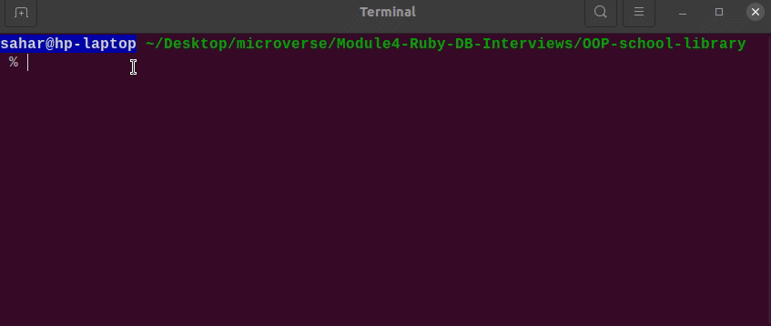

# OOP-school-library

> This project is a tool to record what books are in a library and who borrows them. The app allows users you to:
>
> - Add new students or teachers.
> - Add new books.
> - Save records of who borrowed a given book and when.
>   And all of this is built in a beautiful and well-organized way!



## Built With

- Major languages: Ruby

## Getting Started

To get a local copy up and running follow these simple steps

### Prerequisites

- `ruby` required for running the code.
- `gem` required for linters.

### Setup

Run the following command in your terminal to clone this repo to your local machine

```bash
$ git@github.com:Sahar-AbdelSamad/OOP-school-library.git
```

Change directory into the newly created project

```bash
$ cd OOP-school-library
```

### Usage

#### In the project directory you can run the following command to execute the code:

```bash
$ ruby main.rb
```

#### Or alternatively

#### you can add execute permissions to `main.rb` by running this command

```bash
$ chmod 755 main.rb
```

#### Now the file can be run directly without calling Ruby first

```bash
$ ./main.rb
```

## Authors

👤 **Sahar Abdel Samad**

- GitHub: [@sahar-abdelsamad](https://github.com/Sahar-AbdelSamad)
- Twitter: [@abdelsamadsahar](https://twitter.com/AbdelSamadSahar)
- LinkedIn: [sahar-abdel-samad](https://www.linkedin.com/in/sahar-abdel-samad/)

## 🤝 Contributing

Contributions, issues, and feature requests are welcome!

Feel free to check the [issues page](../../issues/).

## Show your support

Give a ⭐️ if you like this project!

## Acknowledgments

- Hat tip to anyone whose code was used
- Inspiration
- etc
